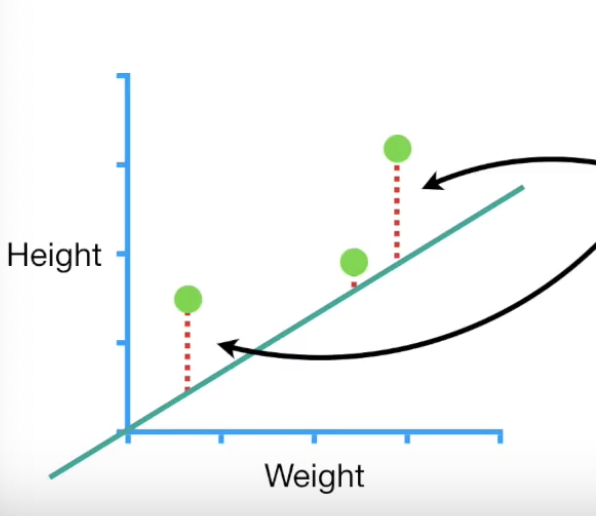

# Gradient Descent Algorithm for Linear Regression

###### It is an optimization algorithm to find the *minimum of a function*. We start with a random point on the function and move in the *negative direction* of the gradient of the function to reach the *local/global minima*.
##### Linear Regression : **predicted y = intercept + slope * x**

------------
### Theory
#### Loss Function

In gradient descent algorithm the  sum of squared residuals is the Loss Function.

------------

##### 	Sum of Square Residuals
The sum of square residuals is nothing but the difference of the predicted y value and the original y value when the parameters are fixed on one particular value and squared.

SOSR = $$(y_p-y_t)^2$$

------------

Loss Function $$J=\frac{1}{2*m}(y_p-y_t)^2$$

We plot the **Loss Function** on an axis and the parameters ( Slope and Intercept in this case ) on the other axes (here we get a 3-D plot becuase of 2 parameters).

> Optimsation or the best fit linear regression model here in this case would be the having the parameters whose loss function would be minimum

A slow and painful method for finding the minimum of the Loss Function is to plug and chug a bunch more values for the parameters .

But the **Gadient Descent Algorithm** is way more efficient.

- It only does a few calculations far from the optimal solution and increases the calculations closer to the optimal value.

- Gradient Descent identifies the optimal value by taking big steps when far away and baby steps when it is near to the minimum.

Gradient descent determines the **Step Size** by multiplying the parameter by a small number called the **learning rate**.
With the step size we update/calculate the new parameters.
##### New Parameter = Old Parameter. - Step Size 

We set a number  a small one under which if the step size falls Gradient descent should stop and also we put a limit on number of stpes it will take before giving up.

------------

####  Finding the minimum of the Loss Function
A way would be to take the *derivative* of the loss function with respect to the paramters ( partial tho ) to find the slope of the Loss function and parameters graph.

------------
### Summary
1. Take the **Gradient**(derivative) of the Loss Function partially with respect to the parameters.
2. Start plugging in values for parameters into the the derivatives calculated.
3. Calculate the Step Sizes and update the parameters.
4. Find where the Gradient Descent Algorithm attains the optimised paramters for the linear regression.

